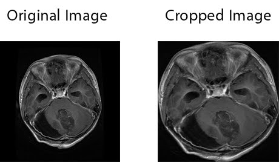
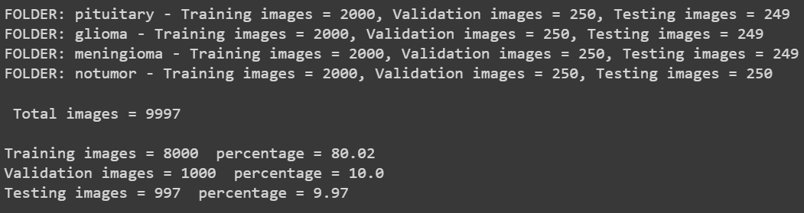
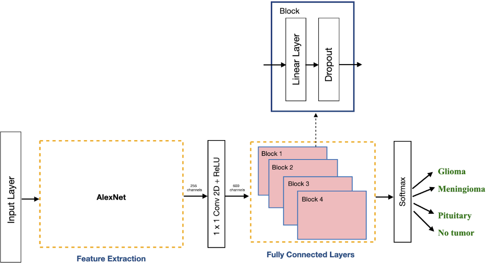
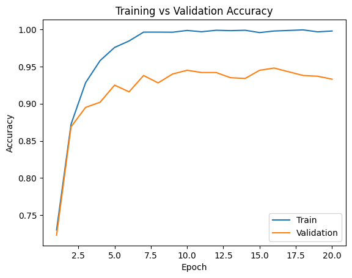
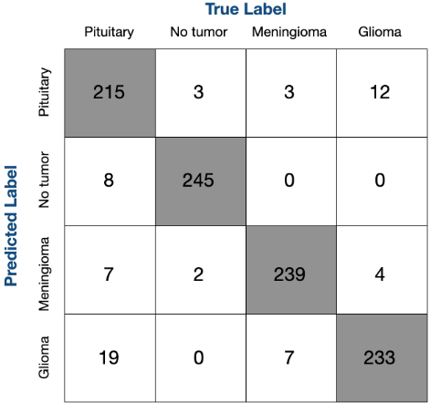
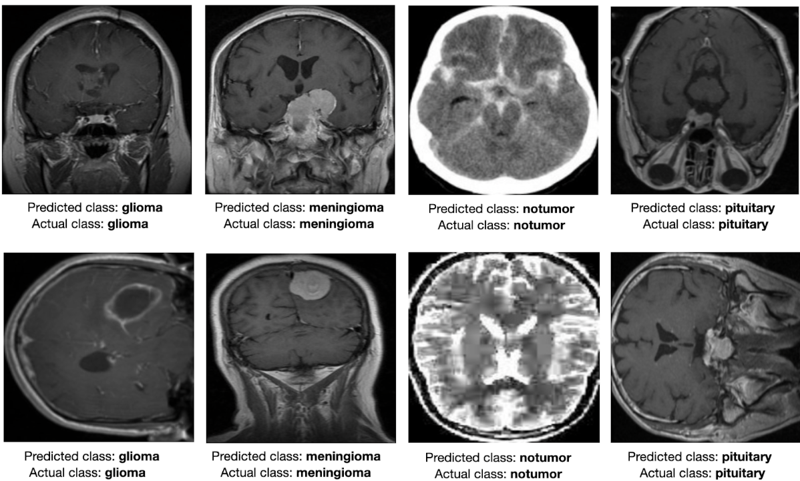

# Brain Tumor Classification using CNN

This project implements a Convolutional Neural Network (CNN) to classify brain tumors from MRI scans. The CNN model aims to detect four categories: Meningioma tumor, Glioma tumor, Pituitary tumor, and the absence of a tumor.

---

## Overview

This project uses deep learning techniques to address the brain tumor classification problem. Convolutional Neural Networks (CNNs) have proven effective in image classification tasks, and in this case, they are used to identify and categorize brain tumors with high accuracy.

---

## Data Processing

### Data Collection

The dataset for this project was sourced from two datasets on Kaggle([Dataset 1](https://www.kaggle.com/datasets/masoudnickparvar/brain-tumor-mri-dataset?select=Training), [Dataset 2](https://www.kaggle.com/datasets/sartajbhuvaji/brain-tumor-classification-mri)), comprising of more than 7000 MRI images across four classes:

- Glioma
- Meningioma
- Pituitary
- No Tumor

The MRI images are resized and preprocessed to ensure compatibility with the CNN model. Each image was resized to **256x256 pixels**, and later further resized to **224x224 pixels** to match the input size for the AlexNet model.

### Data Augmentation

To address the issue of dataset imbalance, dataa was augmented using:

- 90° clockwise rotation
- Vertical flipping

These transformations increased the total number of images in the dataset and helped mitigate the class imbalance problem.

The dataset was split into training, validation, and testing sets using an 80-10-10 split.

---

## Model Architecture

Used the **AlexNet** CNN architecture for the classification task. AlexNet is known for its feature extraction through its five convolutional layers followed by three fully connected layers.

### Transfer Learning

Used transfer learning, starting with a pre-trained **AlexNet** model (trained on the ImageNet dataset).

After extracting features using the pre-trained AlexNet, we added four fully connected layers to complete the classification task. The model was trained using the **Adam optimizer** with a learning rate of **0.0005**.

- **Batch Size:** 256
- **Epochs:** 20
- **Dropout Rate:** 0.5 (used to prevent overfitting)

---

## Model Training and Results

During training, the model was fine-tuned on the training set and validated on the validation set. The final model achieved:

- **Validation Accuracy:** 94.3%
- **Test Accuracy:** 93.48%
- **Test Loss:** 0.342

### Confusion Matrix

The confusion matrix highlights the classification performance across the four categories. It reveals that the model performed well, but had a few false negatives and misclassifications.

---

## Evaluation on New Data

To ensure the model generalizes well, we tested it on a new dataset containing MRI scans it had not encountered before. The model successfully classified all test images.

---